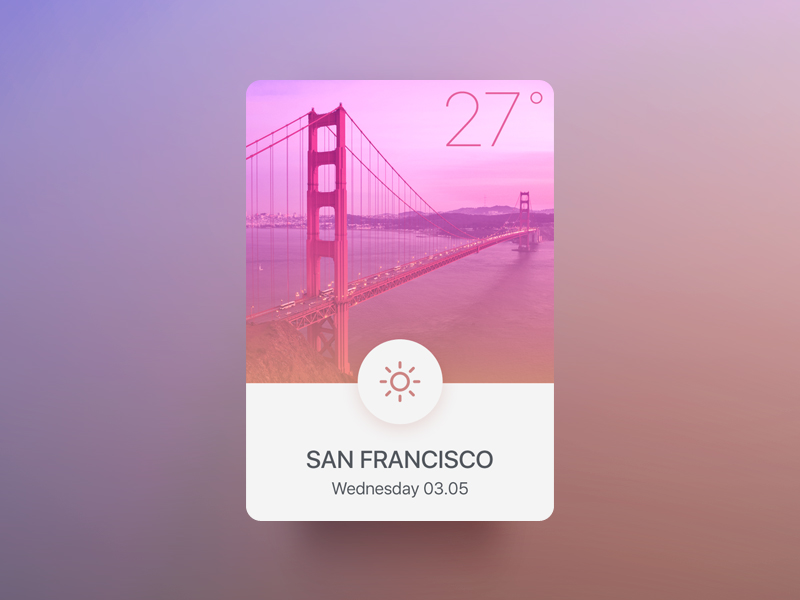

### Application météo
===
  
### TODO 

- [ ] créer une maquette de l'application
- [ ] écrire des "users stories" sous forme de texte

- [ ] faire le front d'une application météo
- [ ] faire en sorte que l'UI/UX soit interressante 
	- [ ] identité visuelle
	- [ ] logo / police / couleurs / boutons

- [ ] choix des jours de la semaine ( lundi au dimanche)
- [ ] scrapping sur une API (météo france ou autre)
- [ ] affiche, par défault, la météo du jour
- [ ] choix des températures (celsius - fahrenheit // matin - après-midi)

etc... à vous d'en ajouter
